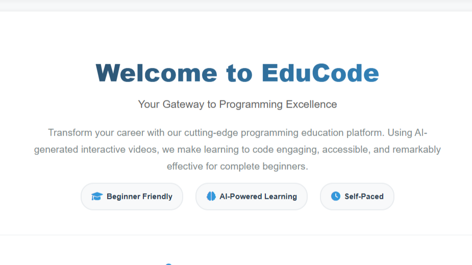
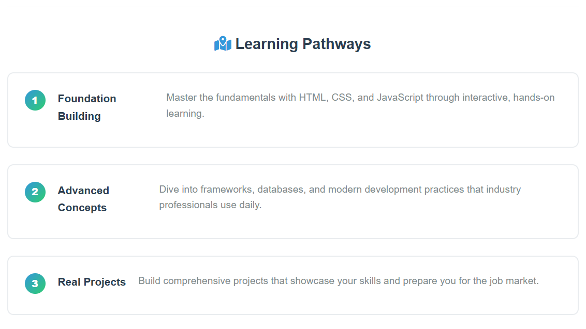
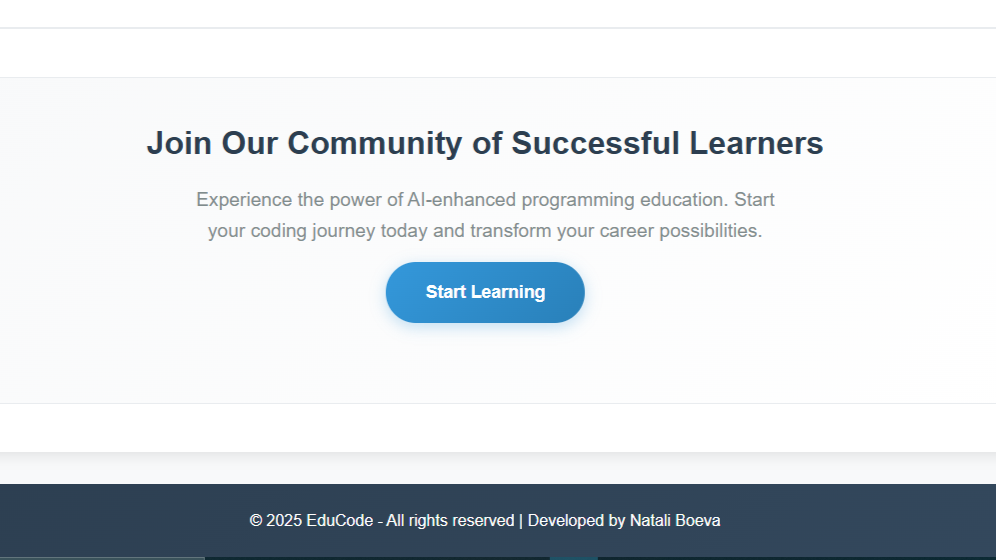
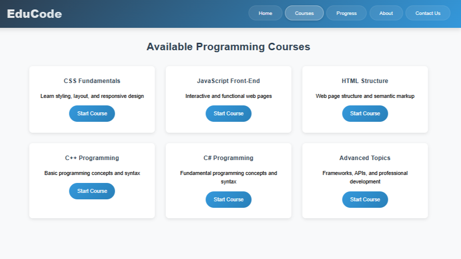
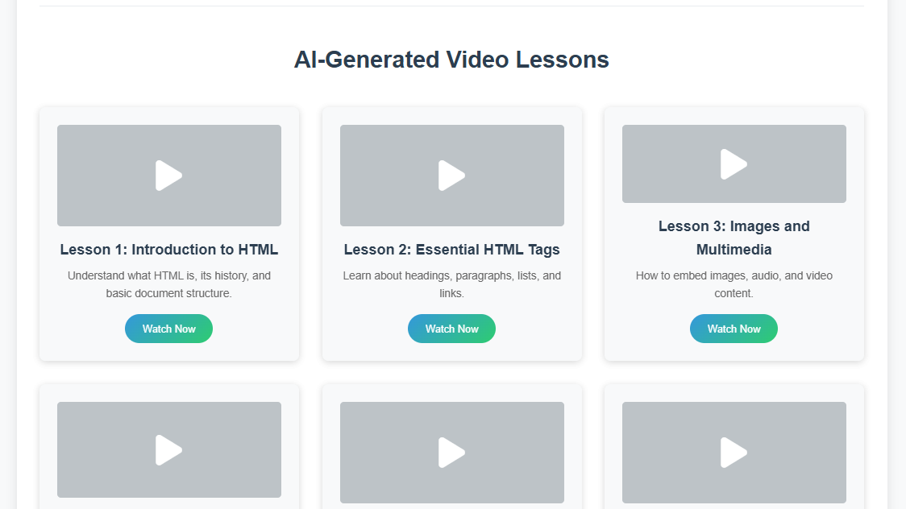
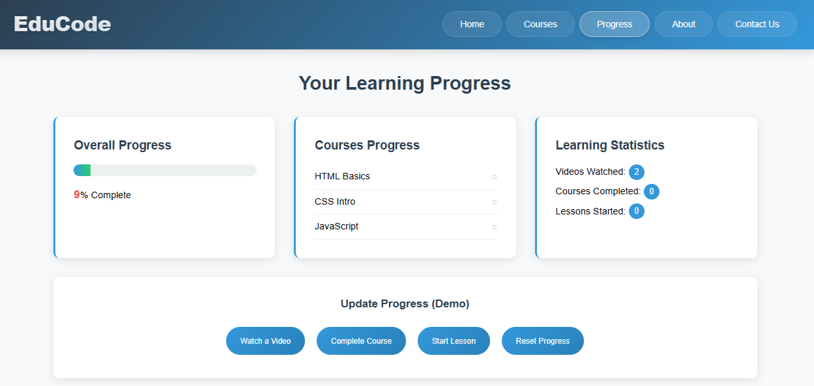
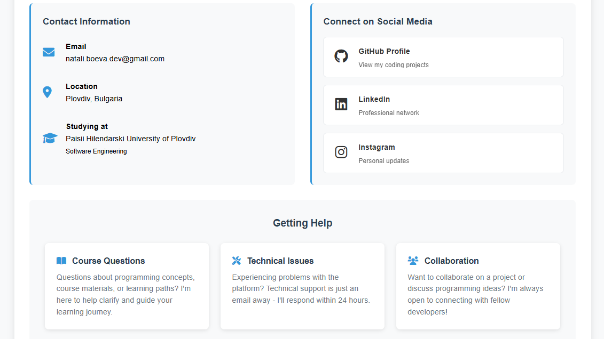

# EduCode

**EduCode** is an interactive AI-enhanced learning platform designed for beginners to learn programming. It features structured courses, video tutorials, and a progress tracking system to help students improve their coding skills. The project includes beginner-friendly lessons in **HTML, CSS, JavaScript, C++, and C#**.

This project was presented to my **Web Programming lecturer at Paisii Hilendarski University in Plovdiv**, and I successfully defended it, receiving an **A**.

---

## Demo

---

## Features

 ☑ **Beginner-friendly courses** for HTML, CSS, JavaScript, C++, and C#  
 ☑ **AI-guided video tutorials** and interactive lessons  
 ☑ **Progress dashboard** with stats tracking  
 ☑ **Responsive and modern UI** suitable for all devices  

---
## Screenshots

<table>
  <tr>
    <td></td>
    <td></td>
    <td></td>
  </tr>
  <tr>
    <td>Home Page</td>
    <td>Home Page 2</td>
    <td>Home Page 3</td>
  </tr>
  <tr>
    <td></td>
    <td></td>
    <td></td>
  </tr>
  <tr>
    <td>Courses Overview</td>
    <td>HTML Course</td>
    <td>Progress Dashboard</td>
  </tr>
  <tr>
    <td></td>
  </tr>
  <tr>
    <td>Contact Page</td>
  </tr>
</table>## Screenshots

<table>
  <tr>
    <td></td>
    <td></td>
    <td></td>
  </tr>
  <tr>
    <td>Home Page</td>
    <td>Home Page 2</td>
    <td>Home Page 3</td>
  </tr>
  <tr>
    <td></td>
    <td></td>
    <td></td>
  </tr>
  <tr>
    <td>Courses Overview</td>
    <td>HTML Course</td>
    <td>Progress Dashboard</td>
  </tr>
  <tr>
    <td></td>
  </tr>
  <tr>
    <td>Contact Page</td>
  </tr>
</table>

---
## Roadmap

- Implement **dark theme** for improved UX  
- Add more **AI-generated videos** for enhanced learning  
- Ensure **additional browser support**  
- Minor **UI improvements** and new interactive features  

---

## Tech Stack

---

## Feedback

If you have any feedback, feel free to contact me at:  
**natali.boeva.dev@gmail.com**

---

## License

This project is licensed under the [MIT License](https://choosealicense.com/licenses/mit/).
